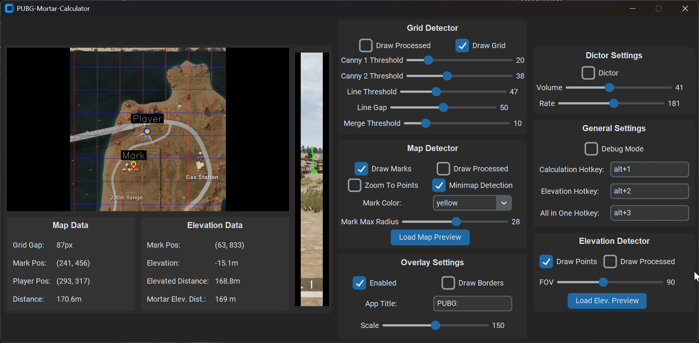
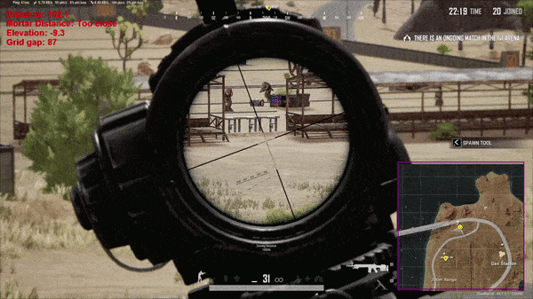

# PUBG Mortar Calculator

A tool to calculate the range of a shot for mortar in PUBG.

## Features

- [X] Quick calculation of planar distance between marks using map
- [X] Quick calculation of firing range of a mortar
- [X] Quick calculation of planar distance between marks using mini-map
- [X] GUI
- [X] Overlay
- [X] Dictor
- [ ] Calculating the distance of an airdrop 
- [ ] Realtime calculation

## Preview

### GUI Preview (v4.0.0)


### Ingame Minimap Preview


## Installation

1. **Clone the repository:**
```bash
git clone https://github.com/IZomBiee/PUBG-Mortar-Calculator.git
cd PUBG-Mortar-Calculator
```

2. **Run with poetry:**
```bash
poetry install
poetry run pubg_mortar_calculator
```

## Using
1. Setup hotkeys for calculation.
2. Use both hotkeys to get map/minimap image and elevation image. (Elevation image must be from mortar first-person view on mark)
3. Enable visualization of grid and marks.
4. Play with settings!

## Revised Technical Notes
- **Minimap Detection**: The minimap detection is not yet perfect; it may occasionally fail to detect objects or produce false positives. While this will be improved in a future update, it generally works well. For better accuracy and stability, use the full map when possible.
- **Marker Detection System**: The marker detection uses a basic (dumb) algorithm that detects the circle with the largest radius in a given range. Because of this, it may occasionally misidentify objects. However, with precise tuning, it is reliable in most cases.
- **Display Settings**: The bot is incompatible with HDR or any settings that alter colors, such as colorblind modes or GPU driver color tweaks.
- **Window Mode**: The bot is not designed for Fullscreen mode; please use Borderless, which does not impact performance. In Fullscreen, the overlay will not function, and if the image is stretched, grid detection will produce incorrect results.
- **Debug Mode**: If Debug Mode is enabled, all calculation results and images are saved to ```last.log```. These can be reloaded into the program to help diagnose the cause of any issues.
- **Feedback**: If you use this tool, please report any bugs or suggest improvements. I will do my best to address them.